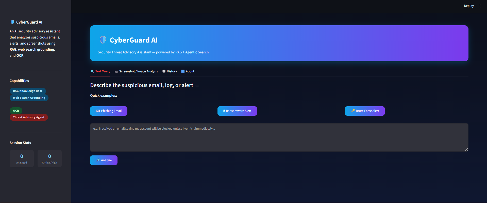
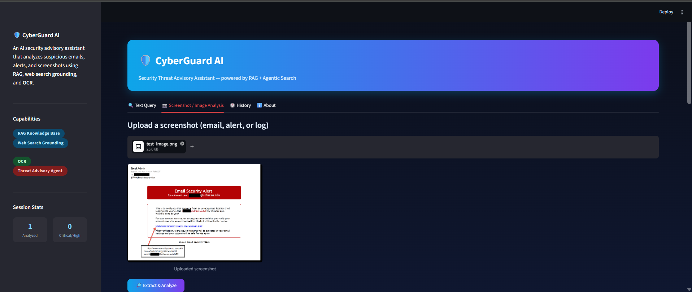
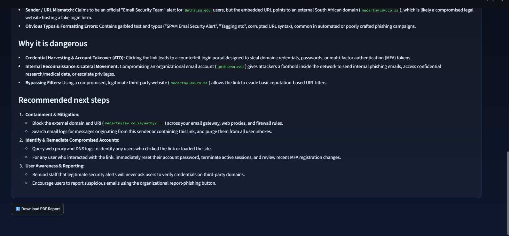
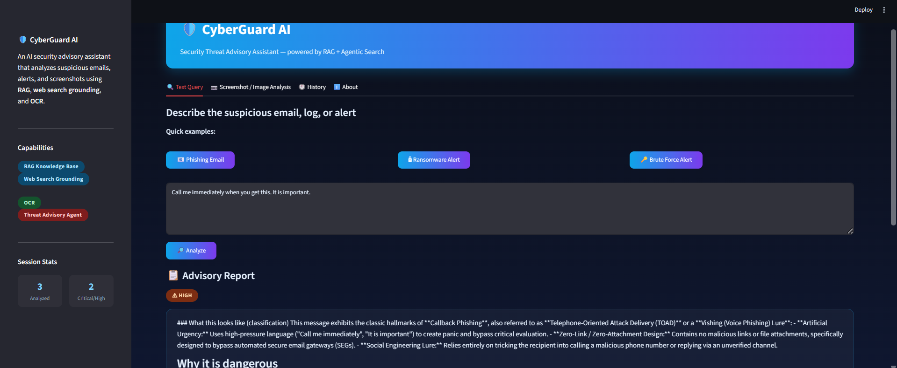
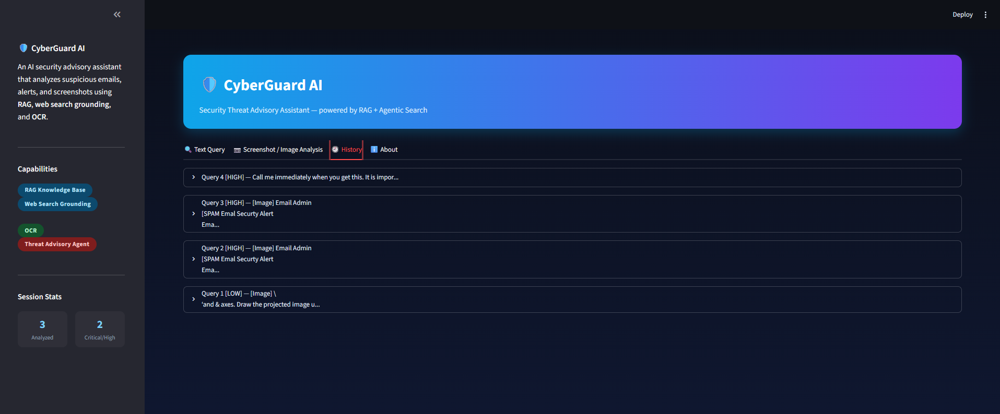
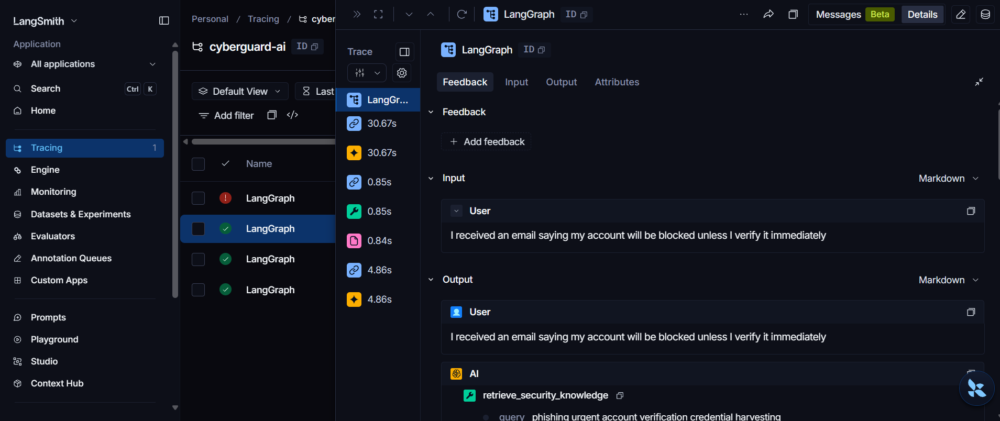
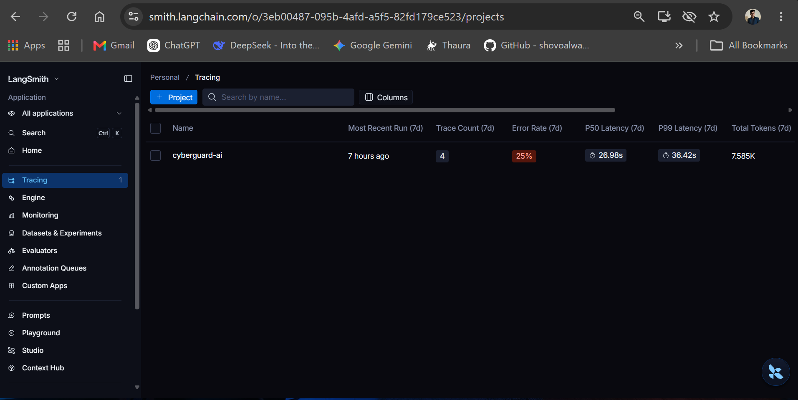
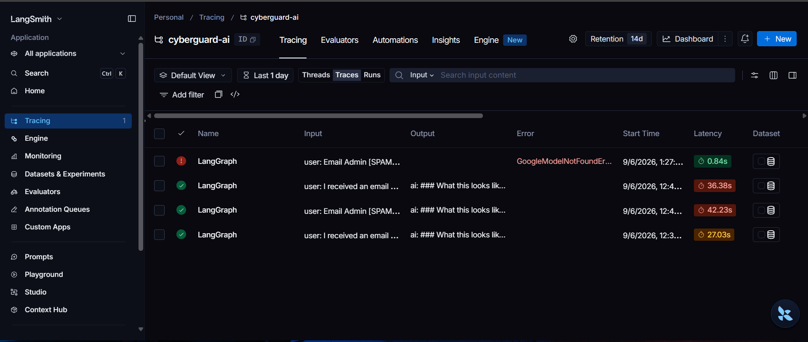
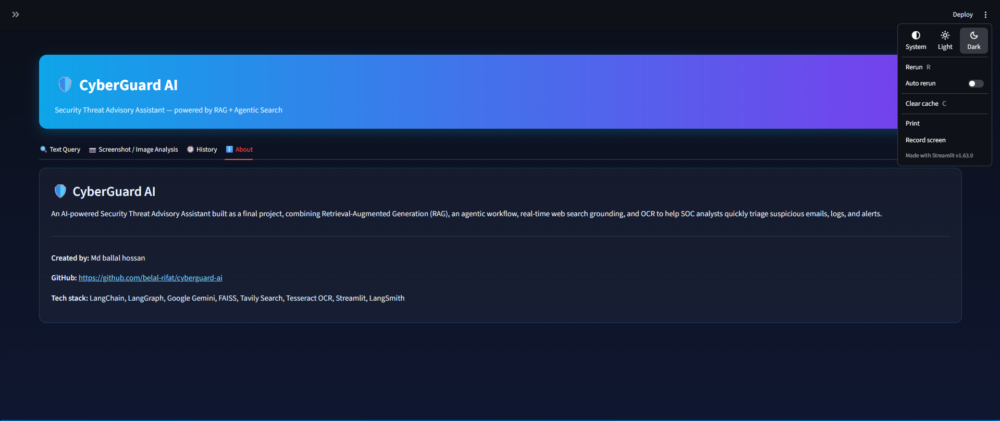

# 🛡️ CyberGuard AI — Security Threat Advisory Assistant

**CyberGuard AI** is an AI-powered Security Operations Center (SOC) advisory assistant designed to help analysts quickly investigate suspicious emails, security alerts, logs, and screenshots.

It combines **Retrieval-Augmented Generation (RAG)**, **AI-powered agentic analysis**, **real-time threat intelligence search**, and **OCR** to generate practical security advisories with severity classification, mitigation steps, knowledge-source citations, IOC extraction, similar-incident detection, PDF reporting, and email drafting.

---

## 🚀 Key Features

### 🔍 AI-Powered Security Analysis

CyberGuard AI analyzes suspicious:

* Emails
* Security alerts
* System logs
* Threat reports
* Screenshots
* SOC investigation data

The AI generates a structured advisory containing:

* **Severity**
* **Threat classification**
* **Why the activity is dangerous**
* **Recommended next steps**

---

### 📚 Retrieval-Augmented Generation (RAG)

CyberGuard AI uses a local **FAISS vector database** to retrieve relevant cybersecurity knowledge before generating an advisory.

The RAG pipeline:

```text
Security Query
      │
      ▼
Query Embedding
      │
      ▼
FAISS Vector Search
      │
      ▼
Top Relevant Knowledge
      │
      ▼
Gemini Security Agent
      │
      ▼
Structured Security Advisory
```

The current knowledge base contains cybersecurity information covering common attack techniques such as:

* Phishing
* Credential Dumping
* Ransomware
* Brute Force
* Malicious Macros

The retriever returns the top relevant knowledge chunks to the security agent.

---

### 🌐 Real-Time Threat Intelligence

When required, the agent can perform web searches using **Tavily** to obtain information about:

* Recent threats
* CVEs
* Active campaigns
* Emerging attack techniques
* Threat information not available in the local knowledge base

This allows CyberGuard AI to combine internal security knowledge with current threat intelligence.

---

### 📷 OCR-Based Screenshot Analysis

Users can upload screenshots of:

* Suspicious emails
* Security alerts
* Logs
* Error messages
* Other security-related content

Tesseract OCR extracts the text from the screenshot, which is then passed to the same security analysis pipeline.

```text
Screenshot
    │
    ▼
Tesseract OCR
    │
    ▼
Extracted Text
    │
    ▼
Security Agent
    │
    ▼
Threat Advisory
```

---

# 🆕 New Security Analysis Features

The latest version introduces several features designed to make CyberGuard AI more useful for practical SOC workflows.

---

## 🧬 1. IOC Extractor

CyberGuard AI automatically extracts **Indicators of Compromise (IOCs)** from the original query and generated advisory.

The IOC extraction feature can identify security-relevant indicators such as:

* IP addresses
* Domains
* URLs
* Email addresses
* Other supported indicators

After generating the advisory, extracted indicators are displayed inside an expandable block:

```text
📋 Advisory Report
        │
        ├── Severity
        ├── Security Advisory
        ├── 📚 RAG Sources
        └── 🧬 Extracted IOCs
```

The IOC section provides copy-friendly text blocks that can be used during investigation or threat-hunting activities.

Implementation:

```python
render_ioc_block()
```

---

## 📚 2. RAG Source Citation

CyberGuard AI now shows which internal knowledge-base documents were used during the analysis.

Example:

```text
📚 Knowledge sources used:

[phishing.txt] [credential_dumping.txt]
```

This improves **transparency and explainability** by allowing analysts to understand which internal knowledge sources contributed to the advisory.

The same RAG source information is also preserved in session history.

Implementation:

```python
render_rag_sources()
```

---

## 🔁 3. Similar Incident Detection

Before starting a new analysis, CyberGuard AI checks the current session history for previously analyzed incidents that are similar to the new query.

If a similar incident is detected, the application displays a warning such as:

```text
🔁 Similar past incident detected (78% match)

Previously flagged as HIGH:
"Multiple failed login attempts were detected..."
```

This can help SOC analysts recognize repeated or related incidents during an investigation session.

The current implementation uses string similarity comparison with a configurable similarity threshold.

Implementation:

```python
render_similar_incident_warning()
```

The check is performed **before the current query is added to history**, preventing the current incident from matching itself.

---

## 📊 4. Severity Distribution Chart

CyberGuard AI now provides a live severity distribution chart in the sidebar.

The chart summarizes analyzed incidents in the current Streamlit session:

```text
Severity Distribution

CRITICAL  ███
HIGH      █████
MEDIUM    ████
LOW       ██
```

This provides a quick SOC-style overview of the severity profile of analyzed incidents.

The chart updates as new investigations are added to session history.

Implementation:

```python
render_severity_chart()
```

---

## 📧 5. Draft Report Email

CyberGuard AI can generate a pre-filled email draft containing the security advisory.

The email includes:

* Severity
* Original query/alert
* Advisory summary
* CyberGuard AI repository reference

The feature uses a `mailto:` link, allowing the user's configured email client to open a ready-to-edit draft.

Implementation:

```python
build_mailto_link()
```

The **Draft Report Email** button is displayed beside the PDF export button.

```text
┌──────────────────────────┐  ┌──────────────────────────┐
│ ⬇️ Download PDF Report   │  │ 📧 Draft Report Email    │
└──────────────────────────┘  └──────────────────────────┘
```

---

# 🧠 Complete Analysis Workflow

The complete CyberGuard AI workflow is:

```text
                 USER INPUT
                     │
             ┌───────┴───────┐
             │               │
          TEXT           SCREENSHOT
             │               │
             │            OCR/Tesseract
             │               │
             └───────┬───────┘
                     │
                     ▼
          Similar Incident Check
                     │
                     ▼
             Security Agent
                     │
          ┌──────────┴──────────┐
          │                     │
          ▼                     ▼
     RAG / FAISS          Tavily Search
          │                     │
          └──────────┬──────────┘
                     │
                     ▼
              Gemini LLM
                     │
                     ▼
          Structured Advisory
                     │
       ┌─────────────┼─────────────┐
       │             │             │
       ▼             ▼             ▼
   Severity        RAG Sources    IOC Extraction
       │
       ▼
  Session History
       │
       ├── Severity Chart
       ├── Similar Incident Detection
       ├── PDF Report
       └── Draft Email
```

---

# 🏗️ Architecture

```text
                         ┌─────────────────────┐
                         │       User          │
                         └──────────┬──────────┘
                                    │
                     ┌──────────────┴──────────────┐
                     │                             │
                Text Query                  Screenshot/Image
                     │                             │
                     │                         Tesseract
                     │                             │
                     └──────────────┬──────────────┘
                                    │
                                    ▼
                         Similar Incident Check
                                    │
                                    ▼
                         ┌─────────────────────┐
                         │   Security Agent    │
                         │ LangChain + Gemini  │
                         └──────────┬──────────┘
                                    │
                    ┌───────────────┴───────────────┐
                    │                               │
                    ▼                               ▼
             ┌─────────────┐                ┌─────────────┐
             │ RAG / FAISS │                │ Tavily Web  │
             │ Knowledge   │                │ Search      │
             │ Base        │                │             │
             └──────┬──────┘                └──────┬──────┘
                    │                               │
                    └───────────────┬───────────────┘
                                    │
                                    ▼
                              Gemini LLM
                                    │
                                    ▼
                         Structured Advisory
                                    │
              ┌─────────────────────┼─────────────────────┐
              │                     │                     │
              ▼                     ▼                     ▼
        IOC Extraction        RAG Citations       Severity Analysis
              │                     │                     │
              └─────────────────────┼─────────────────────┘
                                    │
                                    ▼
                           Streamlit Dashboard
                                    │
        ┌───────────────┬───────────┼───────────┬──────────────┐
        │               │           │           │              │
        ▼               ▼           ▼           ▼              ▼
      History       Severity      PDF        Email       IOC Block
                     Chart        Report       Draft
```

---

# 🛠️ Tech Stack

| Technology            | Purpose                              |
| --------------------- | ------------------------------------ |
| **Python**            | Core application                     |
| **Google Gemini**     | AI security analysis                 |
| **LangChain**         | Agent and tool orchestration         |
| **LangGraph**         | Agent workflow infrastructure        |
| **FAISS**             | Vector similarity search             |
| **Gemini Embeddings** | Knowledge-base embeddings            |
| **Tavily**            | Real-time threat intelligence search |
| **Tesseract OCR**     | Screenshot text extraction           |
| **Streamlit**         | Web interface                        |
| **LangSmith**         | Agent observability and tracing      |
| **fpdf2**             | PDF report generation                |
| **Pandas**            | Severity distribution visualization  |

---

# 📁 Project Structure

```text
cyberguard-ai/
│
├── app.py
│
├── agents/
│   └── security_agent.py
│
├── tools/
│   ├── ocr_tool.py
│   └── search_tool.py
│
├── utils/
│   └── ioc_extractor.py
│
├── rag/
│   ├── build_vectorstore.py
│   └── test_retrieval.py
│
├── data/
│   └── *.txt
│
├── faiss_index/
│   └── ...
│
├── screenshots/
│   └── ...
│
├── .env.example
├── .gitignore
├── requirements.txt
└── README.md
```

---

# ⚙️ Installation

## 1. Clone the Repository

```bash
git clone https://github.com/belal-rifat/cyberguard-ai.git
cd cyberguard-ai
```

## 2. Create a Virtual Environment

### Windows

```bash
python -m venv venv
```

### Git Bash

```bash
source venv/Scripts/activate
```

### PowerShell

```powershell
venv\Scripts\Activate.ps1
```

---

## 3. Install Dependencies

```bash
pip install -r requirements.txt
```

---

# 🔑 Environment Variables

Create a `.env` file based on `.env.example`.

```env
GOOGLE_API_KEY=your_gemini_api_key
TAVILY_API_KEY=your_tavily_api_key
LANGSMITH_API_KEY=your_langsmith_api_key

LANGSMITH_TRACING=true
LANGSMITH_PROJECT=cyberguard-ai
```

Never commit real API keys to GitHub.

---

# 🧠 Build the RAG Knowledge Base

Before running the application, build the FAISS vector index:

```bash
python rag/build_vectorstore.py
```

This creates the local vector store used by the security agent.

---

# ▶️ Run CyberGuard AI

Start the Streamlit application:

```bash
streamlit run app.py
```

Then open:

```text
http://localhost:8501
```

---

# 🖥️ Application Interface

CyberGuard AI currently provides four major sections:

### 🔍 Text Query

Analyze suspicious:

* Emails
* Logs
* Alerts
* Threat descriptions

---

### 📷 Screenshot / Image Analysis

Upload a screenshot and automatically extract text using OCR before performing the security analysis.

---

### 🕘 History

Review previously analyzed incidents during the current Streamlit session.

Each history entry can include:

* Query
* Severity
* Advisory
* RAG knowledge sources

---

### ℹ️ About

View information about:

* CyberGuard AI
* Creator
* Technology stack
* Major capabilities

---

# 📋 Advisory Report

Each analysis produces a structured security advisory.

The report includes:

```text
⚠ SEVERITY

Security Advisory

What this looks like
────────────────────
Threat classification...

Why it is dangerous
────────────────────
Security impact...

Recommended next steps
────────────────────
1. ...
2. ...
3. ...

📚 Knowledge sources used
─────────────────────────
...

🧬 Extracted IOCs
──────────────────
...

⬇️ Download PDF Report
📧 Draft Report Email
```

---

# 🔎 Example Queries

### Phishing

```text
I received an email saying my account will be blocked unless I verify it immediately by clicking a link.
```

### Ransomware

```text
All files on my computer suddenly got renamed with a .locked extension and there is a README_TO_DECRYPT.txt file in every folder.
```

### Brute Force

```text
Our server log shows 500 failed login attempts on the admin account in the last 10 minutes from different IP addresses.
```

---

# 📊 Session Intelligence

CyberGuard AI maintains investigation history within the active Streamlit session.

The session tracks:

```text
Query
Severity
Advisory
RAG Sources
```

This information powers:

* Similar Incident Detection
* Severity Distribution
* History
* RAG Source Citation

> Note: The current history implementation is session-based and is not stored in a persistent external database.

---

# 🔬 LangSmith Observability

CyberGuard AI can be connected to LangSmith for tracing agent execution.

Tracing can help inspect:

* User query
* Agent execution
* Tool calls
* Retrieved context
* Final response

Configure:

```env
LANGSMITH_TRACING=true
LANGSMITH_API_KEY=your_langsmith_api_key
LANGSMITH_PROJECT=cyberguard-ai
```

---

# 🔐 Security Considerations

CyberGuard AI is intended as a **security advisory and analysis assistant**.

It should not be treated as a replacement for:

* Human SOC analysts
* Incident response teams
* EDR/XDR platforms
* SIEM systems
* Threat intelligence platforms
* Formal security investigations

AI-generated security recommendations should be validated before being used for production incident response.

Never place sensitive credentials, API keys, passwords, or confidential information into public repositories.

---

# ⚠️ Current Limitations

* The knowledge base currently contains a limited set of cybersecurity topics.
* Severity classification is AI-inferred rather than fully rule-based.
* Session history is not persistent.
* Similar incident detection currently operates on textual similarity.
* IOC extraction depends on the supported extraction patterns.
* Web-search results depend on Tavily availability and configuration.
* OCR accuracy depends on screenshot quality.
* AI-generated recommendations may require human validation.

---

# 🚀 Future Improvements

Potential future enhancements include:

* [ ] Persistent incident database
* [ ] Full MITRE ATT&CK knowledge base
* [ ] STIX/TAXII threat-intelligence integration
* [ ] VirusTotal IOC enrichment
* [ ] MISP integration
* [ ] Wazuh integration
* [ ] Splunk integration
* [ ] Microsoft Sentinel integration
* [ ] Automated IOC reputation checks
* [ ] Advanced semantic similarity using embeddings
* [ ] Incident correlation across multiple sessions
* [ ] User authentication and role-based access
* [ ] SOC case/ticket management
* [ ] Automated incident-response playbooks
* [ ] Production deployment
* [ ] Docker support
* [ ] REST API
* [ ] Automated threat-report generation

---

# 🎯 Project Goals

CyberGuard AI aims to demonstrate how modern AI techniques can assist SOC analysts by combining:

```text
RAG
+
Agentic AI
+
Threat Intelligence
+
OCR
+
IOC Extraction
+
Incident Correlation
+
Security Reporting
```

The goal is to reduce the time required to understand suspicious security events while providing analysts with transparent and actionable information.

---

##  Screenshots

**Home — Quick examples & text query**


**Screenshot upload & OCR extraction**


**Generated advisory report with severity badge**


**PDF export of the report**


**Session history**


**Tracing**




**About tab**



# 👨‍💻 Creator

**Md Ballal Hossan**

CyberGuard AI was developed as a cybersecurity-focused AI project exploring the practical use of:

* Generative AI
* Retrieval-Augmented Generation
* Security automation
* Threat intelligence
* SOC workflows
* Agentic AI

### GitHub

https://github.com/belal-rifat/cyberguard-ai

---

# 📄 License

This project is intended for educational and research purposes.

See the repository for the applicable license and project terms.
